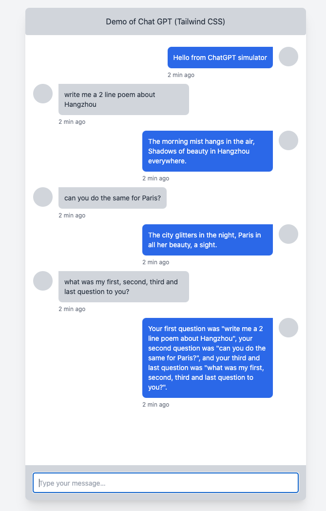

# nextjs-chatgpt-starter

Nextjs frontend starter kit for connecting to API at https://github.com/hochoy/node-chatgpt-starter



To get started:

```bash
# first, spin up a compatible API server at localhost:4000
# you can follow the instructions at https://github.com/hochoy/node-chatgpt-starter
# or edit `./pages/api/chatgpt.js` to make a different http request or communicate with a different service

git clone git@github.com:hochoy/nextjs-chatgpt-starter.git
npm install
npm run dev

```

Guides:

- https://beta.nextjs.org/docs
- https://beta.nextjs.org/docs/styling/tailwind-css
- https://freefrontend.com/tailwind-chats/
- https://nextjs.org/docs/guides/building-forms
- https://beta.reactjs.org/learn/scaling-up-with-reducer-and-context
